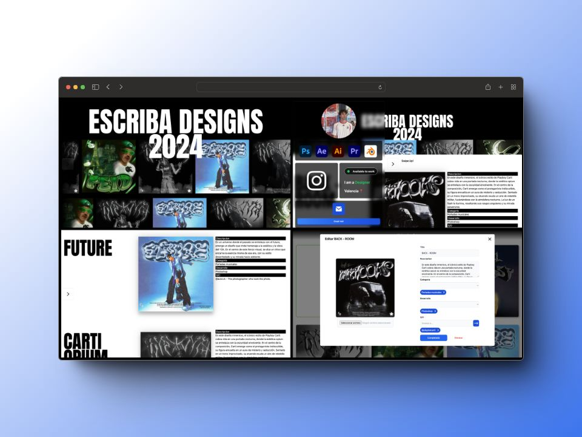

<h1 align="center">
   
  
   
  ESCRIBA DESIGNS
   
</h1>

<h4 align="center">A website for a graphic designer</h4>

  <a href="#key-features">Key Features</a> •
  <a href="#credits">Credits</a> •

## Key Features

* You can see Escriba´s designs
* You can text Escriba by email

## Other

- This project also has a back office in Angular and an API in Nest so that the client can manage and edit their website.

## Credits

This software uses the following open source packages:

- [Angular](https://angular.io/)
- [Bootstrap](https://getbootstrap.com/)
- [Nodejs](https://nodejs.org/en/)
- [Nestjs](https://nestjs.com/)
- [Turso](https://turso.tech/)
- [Escriba](https://www.instagram.com/escribadesigns/)

## Related

[https://escribadesigns-d7b17.web.app/galeria](https://escribadesigns-d7b17.web.app/galeria) - Web version of Escrinba Designs

---

> GitHub [@pabloconejos](https://github.com/pabloconejos) &nbsp;&middot;&nbsp;
> Twitter [@konezk_](https://twitter.com/konezk_)
> Instagram [@alivezk_](https://www.instagram.com/alivezk_/)
> Linkedin [Pablo Conejos](www.linkedin.com/in/pablo-conejos-chirivella-145024252)

